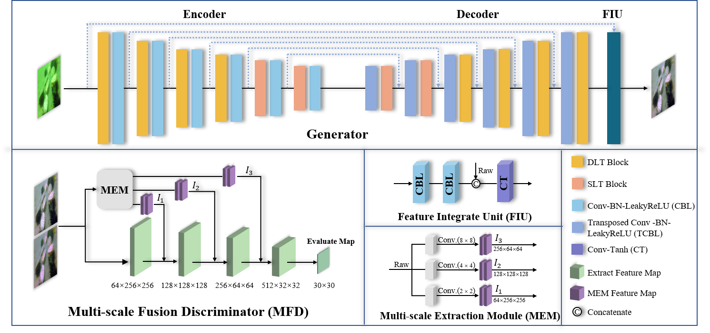

# DDformer: Dimension Decomposition Transformer with Semi-supervised Learning for Underwater Image Enhancement
This is the official implementation for our paper [DDformer: Dimension Decomposition Transformer with Semi-supervised Learning for Underwater Image Enhancement]. We have submitted our paper for publication and it is under review. The source codes will be updated here once the paper is accepted. 

## Abstract


Vision-guided Autonomous Underwater Vehicles (AUVs) have gradually become significant tools for human exploration of the ocean. However, distorted images severely limit the visual ability, making it difficult to meet the needs of complex underwater environment perception. Fortunately, recent advancements in deep learning have led to rapid developments in underwater image enhancement. The emergence of the Transformer architecture has further enhanced the capabilities of deep learning. However, the direct application of Transformer to underwater image enhancement presents challenges in computing pixel-level global information and extracting local features. In this paper, we present a novel approach that merges dimension decomposition Transformer with semi-supervised learning for underwater image enhancement. To begin, dimension decomposition attention is proposed, which enables Transformer to compute global dependencies directly at the original scale and correct color distortions effectively. Concurrently, we employ convolutional neural networks to compensate for Transformer's limitations in extracting local features, thereby enriching details and textures. Subsequently, a multi-stage Transformer strategy is introduced to divide the network into high- and low-resolution stages for multi-scale global information extraction. It helps correct color distortions while enhancing the network's focus on regions with severe degradation. Moreover, we design a semi-supervised learning framework to reduce the reliance on paired datasets and construct a corresponding multi-scale fusion discriminator to enhance the sensitivity to input data. Experimental results demonstrate that our method outperforms state-of-the-art approaches, showcasing excellent learning and generalization capabilities on subjective perception and overall evaluation metrics. Furthermore, outstanding results highlight the significant improvements it brings to downstream visual engineering applications.


## Package dependencies
The project is built with PyTorch 1.13.0, Python3.8, CUDA11.6. For package dependencies, you can install them by:
```bash
pip install -r requirements.txt
```

##Train
```bash
Modify the dataset path in the base_option.py file.
```

##Test
```bash
Modify the dataset path in the base_option.py file.Load the pre trained model parameters and place them in the save_model folder.
```

##Pretrained model
- DDformer: [百度网盘](https://pan.baidu.com/s/14w_sQNx5qIGD4Rbh2Bc-nw) 提取码：hfuu

- ## Citation
If you find this project useful in your research, please consider citing:
```
@article{GAO2024111977,
title = {DDformer: Dimension decomposition transformer with semi-supervised learning for underwater image enhancement},
journal = {Knowledge-Based Systems},
volume = {297},
pages = {111977},
year = {2024},
issn = {0950-7051},
doi = {https://doi.org/10.1016/j.knosys.2024.111977},
url = {https://www.sciencedirect.com/science/article/pii/S0950705124006117},
author = {Zhi Gao and Jing Yang and Fengling Jiang and Xixiang Jiao and Kia Dashtipour and Mandar Gogate and Amir Hussain},
}
```
